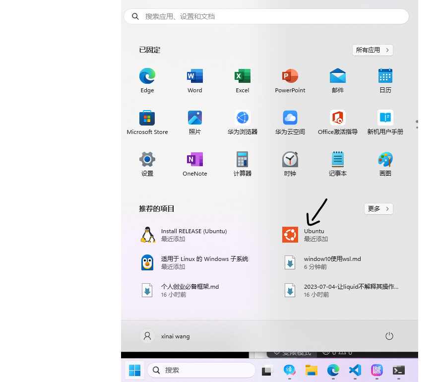

WSL是适用于Liunx的windows子系统，使我们同时使用windows和linux，不用使用虚拟机或双启动的成本。

查看[WSL官方][WSL官方]介绍查看先决条件和更多信息。

**只须一行命令，即可在windows上使用linux!爽爽爽爽爽**
```bash
# 安装。以管理员身份打开cmd,运行如下命令。然后重启计算机。
wsl --install
```
重启计算机后，使用“开始”菜单打开该发行版（默认情况下为 Ubuntu）。



[WSL官方]:https://learn.microsoft.com/zh-cn/windows/wsl/install