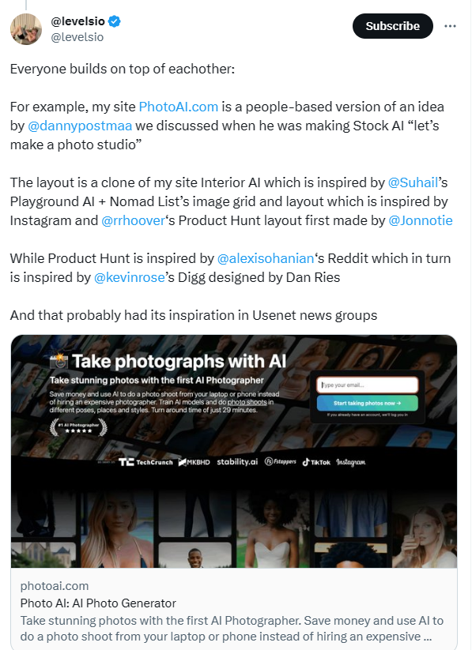

> 实践和模仿是比阅读/听课更有效的学习方法。

# SEO
SEO，Search engine optimization, 是指对网站进行搜索引擎优化,使在搜索结果中靠前排列，有很多种方式，因为本系列是对[photoai项目](https://photoai.com/)的解析，所以专注在这个网站上。
谷歌提供了[SEO](https://developers.google.cn/search/docs/crawling-indexing)的建议文档。
1. 设置一个好的域名。photoai域名很简单，也很直白，非常符合英文用户搜索的习惯。
2. 进行搜索引擎结构化数据处理。目前主流搜索引擎支持三种类型的结构化数据标记格式：[JSON-LD](#json-ld)，Microdata，[RDFa](#rdfa)。谷歌在2015年宣布JSON-LD作为首选方法。

|||||
|--|--|--|--|
||特点|用处 | |
|JSON-LD | - 对网页展示没有影响; <br>- 统一的位置。键值对 | 搜索引擎索引 | |
|RDFa | - 分散在html属性上 | 社交媒体显示 | 

## JSON-LD
JSON-LD是隐藏的，它对网页的展示没有影响，让网站管理员更容易实现。

使用[schema.org](https://schema.org/)词汇表实现，通过[github](https://github.com/schemaorg/schemaorg)维护。

可以使用[google官方工具](https://www.google.com/webmasters/markup-helper/)生成json-ld。
示例：https://photoai.com/ 网站的JSON-LD代码
```html
<script type="application/ld+json">
	{
		"@context":"https://schema.org",
		"@graph":[
			{
				"@type":"Organization",
				"@id":"https://photoai.com/#organization",
				"name":"Photo AI",
				"url":"https://photoai.com",
				"sameAs":[
					"https://www.instagram.com/photoaiio/"
				],
				"email":"no-reply@photoai.com",
				"logo":{
					"@type":"ImageObject",
					"@id":"https://photoai.com/#logo",
					"url":"https://photoai.com/assets/logo.svg",
					"contentUrl":"https://photoai.com/assets/logo.svg",
					"caption":"Photo AI",
					"inLanguage":"en-US"
				},
				"contactPoint":[
					{
						"@type":"ContactPoint",
						"telephone":"+65 0000 0000",
						"contactType":"customer support"
					}
				]
			},
			{
				"@type":"WebSite",
				"@id":"https://photoai.com/#website",
				"url":"https://photoai.com",
				"name":"Photo AI",
				"publisher":{
					"@id":"https://photoai.com/#organization"
				},
				"inLanguage":"en-US"
			},
			{
				"@type":"ImageObject",
				"@id":"https://photoai.com/cdn-cgi/image/format=jpeg,fit=cover,width=1024,height=512,quality=85/https://photoai.com/assets/photo-ai-social-media-pic-2023-06-05.png?2",
				"url":"https://photoai.com/cdn-cgi/image/format=jpeg,fit=cover,width=1024,height=512,quality=85/https://photoai.com/assets/photo-ai-social-media-pic-2023-06-05.png?2",
				"caption":"",
				"inLanguage":"en-US"
			},
						{
				"@type":"Product",
				"brand":{
					"@type":"Brand",
					"name":"Photo AI"
				},
				"name":"Photo AI: AI Photo Generator",
				"description":"Take stunning photos with the first AI Photographer. Save money and use AI to do a photo shoot from your laptop or phone instead of hiring an expensive photographer. Create AI models (of yourself!) and do photo shoots in different poses, places and styles. Try on clothes you upload on your own AI model. Turn around time of just 14 seconds.",
				"sku":"",
				"category":"Photo Shoots",
				"mainEntityOfPage":{
					"@id":"https://photoai.com/#webpage"
				},
				"aggregateRating":{
					"@type":"AggregateRating",
					"ratingValue":"5.00",
					"bestRating":"5",
					"ratingCount":"24",
					"reviewCount":"24"
				},
				"review":[
					{
						"@type":"Review",
						"@id":"https://photoai.com/#li-comment-1505902",
						"description":"Couldn't recommend Photo AI any higher! The AI Photographer is incredibly professional and knowledgeable. It's amazing how this AI system can understand and cater to your specific needs. It showed a genuine interest in what I wanted to get out of my shoot and went above and beyond to make sure I was happy. The convenience of being able to do a photo shoot from my laptop or phone at home is unbeatable. I'm eagerly looking forward to seeing what stunning content gets created in the future!",
						"datePublished":"2022-12-12 16:19:56",
						"reviewRating":{
							"@type":"Rating",
							"ratingValue":"5",
							"bestRating":"5",
							"worstRating":"1"
						},
						"author":{
							"@type":"Person",
							"name":"Riah Hutchins"
						}
					},
					{
						"@type":"Review",
						"@id":"https://photoai.com/#li-comment-1502230",
						"description":"My experience with Photo AI was absolutely awesome! As a first-timer doing a photo shoot like this, I was amazed by the results. The AI Photographer provided me with great tips and suggestions for my poses that made a huge difference in how I looked. I highly recommend their services for anyone looking to capture incredible photographs without the hassle of traditional photo shoots. Trust me, you won't be disappointed!",
						"datePublished":"2022-04-11 12:47:07",
						"reviewRating":{
							"@type":"Rating",
							"ratingValue":"5",
							"bestRating":"5",
							"worstRating":"1"
						},
						"author":{
							"@type":"Person",
							"name":"Jay Glover"
						}
					},
					{
						"@type":"Review",
						"@id":"https://photoai.com/#li-comment-1502060",
						"description":"I would not hesitate to recommend Photo AI to anyone showcasing their physique, transformations, or fitness in general. The communication leading up to the shoot was fantastic right from the first contact, and the expertise of the AI Photographer really put me at ease. I was amazed by the outstanding quality of the photos produced by the AI. The convenience of having a professional photo shoot experience from the comfort of your own home is unmatched. Don't miss out on this incredible service!",
						"datePublished":"2022-03-17 13:31:23",
						"reviewRating":{
							"@type":"Rating",
							"ratingValue":"5",
							"bestRating":"5",
							"worstRating":"1"
						},
						"author":{
							"@type":"Person",
							"name":"Ashley Jones"
						}
					},
					{
						"@type":"Review",
						"@id":"https://photoai.com/#li-comment-1500408",
						"description":"The quality of Photo AI's work speaks for itself! I was amazed by how this AI Photographer can make the whole experience fun and enjoyable while getting the best out of their clients, no matter their skill level. Working with Photo AI was an absolute pleasure, and I cannot recommend them enough. The convenience of having a professional photo shoot from the comfort of your own home is a game-changer. I'll definitely be using their services again in the future!",
						"datePublished":"2021-09-05 09:05:51",
						"reviewRating":{
							"@type":"Rating",
							"ratingValue":"5",
							"bestRating":"5",
							"worstRating":"1"
						},
						"author":{
							"@type":"Person",
							"name":"Adam Henry"
						}
					},
					{
								"@type":"Review",
								"@id":"https://photoai.com/#li-comment-1498536",
								"description":"I was skeptical at first about using an AI Photographer, but Photo AI completely exceeded my expectations! The photos turned out absolutely stunning. The AI Photographer has an incredible eye for detail and composition. It's mind-blowing how I can now have professional-quality photoshoots without leaving my house. I highly recommend Photo AI to anyone looking for convenience, quality, and affordability.",
								"datePublished":"2021-07-22 14:12:36",
								"reviewRating":{
										"@type":"Rating",
										"ratingValue":"5",
										"bestRating":"5",
										"worstRating":"1"
								},
								"author":{
										"@type":"Person",
										"name":"Emily Sullivan"
								}
						},
						{
								"@type":"Review",
								"@id":"https://photoai.com/#li-comment-1495322",
								"description":"Photo AI is a game-changer! As a busy entrepreneur, I don't have time to schedule and travel to traditional photo shoots. With this AI Photographer, I can capture professional-grade images for my brand right from my laptop. The results are impressive, and the whole process is incredibly efficient. I'm thrilled with the quality and convenience. This service is worth every penny!",
								"datePublished":"2021-05-09 11:27:19",
								"reviewRating":{
										"@type":"Rating",
										"ratingValue":"5",
										"bestRating":"5",
										"worstRating":"1"
								},
								"author":{
										"@type":"Person",
										"name":"Michael Thompson"
								}
						},
						{
								"@type":"Review",
								"@id":"https://photoai.com/#li-comment-1491234",
								"description":"I am amazed by the capabilities of Photo AI's AI Photographer. It captures moments with such precision and artistry. The attention to detail in the photographs is remarkable. I never thought I could achieve such professional-looking shots without hiring an expensive photographer. The convenience and affordability of this service make it a no-brainer. I highly recommend Photo AI to everyone!",
								"datePublished":"2021-03-14 09:58:03",
								"reviewRating":{
										"@type":"Rating",
										"ratingValue":"5",
										"bestRating":"5",
										"worstRating":"1"
								},
								"author":{
										"@type":"Person",
										"name":"Sophia Chen"
								}
						},
						{
								"@type":"Review",
								"@id":"https://photoai.com/#li-comment-1489002",
								"description":"Photo AI's AI Photographer is a revelation! The quality of the photos it produces is outstanding. The attention to detail and the ability to capture emotions are remarkable. I love how I can now have personalized photo shoots anytime, anywhere, without the hassle of scheduling and coordinating with a human photographer. This service has truly made my life easier and more beautiful.",
								"datePublished":"2021-01-25 16:40:12",
								"reviewRating":{
										"@type":"Rating",
										"ratingValue":"5",
										"bestRating":"5",
										"worstRating":"1"
								},
								"author":{
										"@type":"Person",
										"name":"David Patel"
								}
						}
				],
				"offers":{
					"@type":"Offer",
					"price":"30",
					"priceCurrency":"USD",
					"priceValidUntil":"2024-07-10",
					"availability":"https://schema.org/InStock",
					"itemCondition":"NewCondition",
					"url":"https://photoai.com/",
					"seller":{
						"@type":"Organization",
						"@id":"https://photoai.com/",
						"name":"Photo AI",
						"url":"https://photoai.com",
						"logo":"https://photoai.com/assets/logo.svg"
					},
					"shippingDetails": {
						"@type":"OfferShippingDetails",
						"deliveryTime":{
							"@type":"ShippingDeliveryTime",
							"handlingTime": {
								"@type": "QuantitativeValue",
								"minValue": "0",
								"maxValue": "29",
								"unitCode": "MIN"
							},
							"transitTime": {
								"@type": "QuantitativeValue",
								"minValue": "0",
								"maxValue": "14",
								"unitCode": "SEC"
							}
						}
					},
					"hasMerchantReturnPolicy": {
						"@type": "MerchantReturnPolicy",
						"returnPolicyCategory": "https://schema.org/MerchantReturnFiniteReturnWindow",
						"merchantReturnDays": 30,
						"returnMethod": "https://schema.org/ReturnInStore",
						"returnFees": "https://schema.org/FreeReturn"
					}
				},
				"@id":"https://photoai.com/#richSnippet",
				"image":{
					"@id":"https://photoai.com/cdn-cgi/image/format=jpeg,fit=cover,width=1024,height=512,quality=85/https://photoai.com/assets/photo-ai-social-media-pic-2023-06-05.png?2"
				}
			}
		]
	}
</script>
```

# RDFa
使用方式:

```html
<meta property="og:title" content="Photo AI: AI Photo Generator">
<meta property="og:url" content="https://photoai.com/">
<meta property="og:site_name" content="Photo AI">
<meta property="og:description" content="Take stunning photos with the first AI Photographer. Save money and use AI to do a photo shoot from your laptop or phone instead of hiring an expensive photographer. Create AI models (of yourself!) and do photo shoots in different poses, places and styles. Try on clothes you upload on your own AI model. Turn around time of just 14 seconds.">
<meta property="og:image" content="https://photoai.com/cdn-cgi/image/format=jpeg,fit=cover,width=1024,height=512,quality=85/https://photoai.com/assets/photo-ai-social-media-pic-2023-06-05.png?2?1688955358">
<meta property="og:type" content="website">
<meta property="og:updated_time" content="1970-01-01T00:00:00+00:00">
<meta http-equiv="last-modified" content="1970-01-01T00:00:00+00:00"> 
<meta name="last-modified" content=""> 
<meta name="twitter:card" content="summary_large_image">
<meta name="twitter:site" content="@levelsio">
<meta name="twitter:creator" content="@levelsio">
<meta name="twitter:title" content="Photo AI: AI Photo Generator">
<meta name="twitter:description" content="Take stunning photos with the first AI Photographer. Save money and use AI to do a photo shoot from your laptop or phone instead of hiring an expensive photographer. Create AI models (of yourself!) and do photo shoots in different poses, places and styles. Try on clothes you upload on your own AI model. Turn around time of just 14 seconds.">
<meta name="twitter:image:src" content="https://photoai.com/cdn-cgi/image/format=jpeg,fit=cover,width=1024,height=512,quality=85/https://photoai.com/assets/photo-ai-social-media-pic-2023-06-05.png?2">
<meta name="twitter:url" content="https://photoai.com/">
```

og:title等这些是[facebook的开放图协议词汇表](https://ogp.me/)。twitter:card等是适用于twitter平台的。
这些元数据供你分享网站到facebook或twitter社交媒体时，他们显示丰富的图像、格式、标题、摘要和链接，而不是纯文本。

[这里](https://www.liuxing.io/blog/meta-tags-for-social-media/)有一篇更好的中文介绍。
## 介绍RDFa
RDFa是便于爬虫软件理解网页的，或者说是用来SEO的，提高网站在搜索引擎中的排名。是w3c标准的一部分，它为html \ xhtml \ 各种以xml为基础的网络文档类型绑定元数据。**大概2004年开始编写，最近一次标准更新在2015年。值得注意的是，谷歌在2015年宣布[JSON-LD](#JSON-LD)作为首选方法。**

RDFa认为，虽然网络最初是按照被人类消费阅读的目的来构建的，但是网络被越来越多的机器消费（爬虫、搜索引擎），机器喜欢大量的结构化数据。网站开始定义网页title、文章类型、预览图片，以便在用户点击‘喜欢’按钮时，给用户的新闻喜好推荐提供合适的信息。搜索引擎已经开始通过从它们抓取的网页中提取细粒度的结构化细节来提供更丰富的搜索结果。反过来，网站发布者也更多地向他们的网站中添加结构化数据，以提高他们在搜索引擎中的地位（更容易被搜索引擎搜索到，更容易被用户发现他们的网站）。
实现这种变化的前提是能够直接向HTML添加结构化数据，这一技术就是RDFa，它提供了一系列标记属性，增强爬虫程序的视觉（读取信息的能力）、使爬虫不用点击所有链接，节约计算机资源。

有多种使用方式：

- 完整的url
使用url的原因是消除歧义，增强代码可移植性。将这个url下的所有词称为词汇表。
```html
<!-- property属性：使用property属性标记这是文章的标题，以便爬虫知晓 -->
<h2 property="http://purl.org/dc/terms/title">The Trouble with Bob</h2>
```

-  拼接的url
```html
<!-- vocab + property 
    vocab 作为根url, 减少url全路径的编写；
    property作为具体的标签上使用的属性。
-->
<html>
<head>
  ...
</head>
<body vocab="http://purl.org/dc/terms/">
  ...
  <h2 property="title">The Trouble with Bob</h2>
  <p>Date: <span property="created">2011-09-10</span></p>
  ...
</body>

<!-- vocab + resource + property -->
<body vocab="http://purl.org/dc/terms/">
   ...          
   <div resource="/alice/posts/trouble_with_bob">
      <h2 property="title">The trouble with Bob</h2>
      <p>Date: <span property="created">2011-09-10</span></p>
      <h3 property="creator">Alice</h3>
      ...
   </div>
   ...
   <div resource="/alice/posts/jos_barbecue">
      <h2 property="title">Jo's Barbecue</h2>
      <p>Date: <span property="created">2011-09-14</span></p>
      <h3 property="creator">Eve</h3>
      ...
   </div>
   ...
</body>    

<!-- prefix + property 
    prefix给根url重命名，以便后续属性调用。支持-->
<html>
 <head>
   ...
 </head>
 <body prefix="dc: http://purl.org/dc/terms/ schema: http://schema.org/">
   <div resource="/alice/posts/trouble_with_bob" typeof="schema:BlogPosting">
      <h2 property="dc:title">The trouble with Bob</h2>
      ...
      <h3 property="dc:creator" resource="#me">Alice</h3>
      <div property="schema:articleBody">
        <p>The trouble with Bob is that he takes much better photos than I do:</p>
      </div>
     ...
   </div>
 </body>
</html>
```
- 其他词汇表。比如facebook的og。

参考链接：
- https://yeahexp.com/what-is-the-prefix-attribute-for-in-the-html-tag/#:~:text=%3Chtml%20prefix%3D%22og%3A%20http%3A%2F%2Fogp.me%2Fns%23%22%3E%20Answer%3A%20The%20prefix%20attribute%20is,created%20to%20support%20Semantic%20Web%20on%20web%20pages.
- [RDFa-w3c标准](https://www.w3.org/TR/rdfa-primer/)