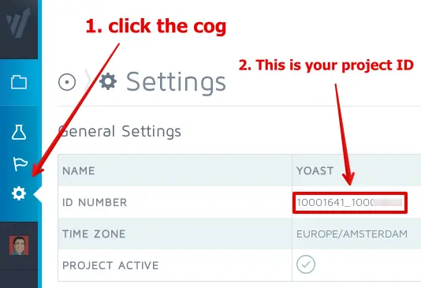

> 实践和模仿是比阅读/听课更有效的学习方法。

# meta
```html
	<meta http-equiv="Content-Type" content="text/html; charset=UTF-8">
	<meta name="application-name" content="Photo AI">
	<!-- 控制视口（网站可见内容部分）大小和形状。 适配用户的屏幕大小、放大缩小操作、移动端页面。此处配置是指页面自适应、首次打开页面按100%显示、用户可以缩放 -->
	<meta name="viewport" content="width=device-width, initial-scale=1, user-scalable=yes">
	<!-- 让页面以独立app的形式运行。 -->
	<meta name="apple-mobile-web-app-capable" content="yes">
	<meta name="apple-mobile-web-app-status-bar-style" content="#000000">
	<meta name="apple-mobile-web-app-title" content="Photo AI">
	<meta name="mobile-web-app-capable" content="yes">
	<meta name="theme-color" content="#000000">
```
# link
```html
	<!-- link用于链接样式表rel='stylesheet'、创建站点图标rel='icon' -->
	<link rel="icon" href="https://photoai.com/assets/favicon.ico?3" type="image/x-icon">
	<link rel="icon" type="image/png" sizes="32x32" href="https://photoai.com/assets/favicon-32x32.png?3">
	<link rel="icon" type="image/png" sizes="16x16" href="https://photoai.com/assets/favicon-16x16.png?3">
	<!-- 不同移动平台上特殊的图表类型 -->
	<link rel="apple-touch-icon" sizes="76x76" href="https://photoai.com/assets/apple-touch-icon.png?3">
	<!-- anifest是HTML5引入的应用程序缓存，即在没有网络的情况下可以进行访问。 -->
	<link rel="manifest" href="https://photoai.com/manifest.json">
	<!-- 当前文档的首要 URL。 -->
	<link rel="canonical" href="https://photoai.com/">
	<!-- 站点地图。用于[SEO](https://developers.google.cn/search/docs/crawling-indexing/sitemaps/overview?hl=zh-cn)。其实网站规模较少不需要站点地图。 -->
	<link rel="sitemap" href="https://photoai.com/sitemap" type="application/xml">
```
使用的链接：[SEO](https://developers.google.cn/search/docs/crawling-indexing/sitemaps/overview?hl=zh-cn)、

制作icon：制作icon也是一门学问。先挖个坑。
# cdn
[cdn是什么？](https://vue3js.cn/interview/http/CDN.html)。cdn是一种加快网站访问速度的技术。它将网站存储在中央节点，分发到边缘节点，用户访问网站时，会寻找最近的边缘节点，以提高访问速度。cloudflare有一种开源免费的方案。
```html
	<!-- 使网站访问更快，更稳定。 -->
	<!-- begin Convert Experiences code-->
	<script type="text/javascript" src="//cdn-4.convertexperiments.com/js/10041116-10041057.js"></script>
	<!-- end Convert Experiences code -->
```
这里是worldpress的一项付费功能插件，提供A/B测试等功能。


# 网站是用wordpress建的吗？
用docker安装wordpress
```bash
docker pull wordpress:latest
docker pull mysql:5.7
docker container run   -d   --rm   --name wordpressdb   --env MYSQL_ROOT_PASSWORD=123456   --env MYSQL_DATABASE=wordpress   mysql:5.7

docker container run   -d -p 8080:80  --rm   --name wordpress   --env WORDPRESS_DB_PASSWORD=123456  --env WORDPRESS_DB_USER=root --link wordpressdb:mysql  wordpress
# 然后访问localhost:8080即可打开wordpress引导安装界面。
```
从wordpress提供的服务和风格来看
