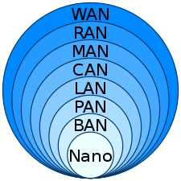

# 教程
尚硅谷-docker
[阮一峰-docker][阮一峰-docker]
docker官网

# 概述
为什么学docker?
- docker本身的能力：容器化部署。
- 市场环境: 一切在云端，万物皆容器
    职业要求: 云原生java架构师（k8s + docker + kubesphere + devops）

前置知识：
spring bot cloud
git redis nginx mysql…
linux centos ubuntu
下一步：
k8s

# 主要内容：
## 简介、使用场景、安装、
把源码 + 配置 + 环境 + 版本 + ...， 全部打包成镜像，实现平滑迁移。
与虚拟机通过操作系统实现隔离不同，容器技术**只隔离应用程序的运行时环境但容器之间可以共享同一个操作系统**，这里的运行时环境指的是程序运行依赖的各种库以及配置。
- 与操作系统动辄几G的内存占用相比，容器技术只需数M空间。
- 启动速度快。
- 依赖都打包到了container, build once, run everywhere
- 提供弹性的云服务。因为docker容器可以随开随关，很适合动态扩容缩容。
- 组建微服务架构。通过多个容器，一台机器跑多个服务。
用Go语言实现。

**安装**安装官网指引即可。或查看[阮一峰][阮一峰]大佬的文章。
windows安装有个installer，下载下来一步步安装即可。

## 架构
- Dockerfile 文件。它是一个文本文件，用来配置 image。Docker 根据 该文件生成二进制的 image 文件
- image文件： 应用程序及其依赖被打包在这里。通过这个文件生成docker容器，同一个image可以生成多个容器实例。
- contianer
- Docker client
- Docker daemon
- docker engine

image文件是一个二进制文件。通用，可以继承。可以尽量使用别人制作好的image文件或基于别人的文件加工。


## 常用命令及参数解释、
**image**
```bash
# 列出本机的所有 image 文件。
$ docker image ls

# 删除 image 文件
$ docker image rm [imageName]

# 抓取image文件
docker image pull library/hello-world
# 利用dockerfile生成image
docker image build -t koa-demo .

# 上传image
docker image tag [imageName] [username]/[repository]:[tag]
# 上传image实例
docker image tag koa-demos:0.0.1 ruanyf/koa-demos:0.0.1
# 上传发布 image 文件 到docker社区。
docker image push [username]/[repository]:[tag]
```

```bash
docker run -d -p 8080: 8080 tomcat
# 抓取ubuntu image并运行Ubuntu容器
docker run -it ubuntu bash
# 运行容器。
docker container run --rm -p 8000:3000 -it koa-demo:0.0.1
```

**container**
```bash
# 运行这个image文件
docker container run hello-world
# 查看正在运行的container
docker container ls
# 查看占据硬盘空间的container
docker container ls --all
docker container start [containerID]
# 查看日志。如果没有用-it参数启动，可以这样看。
docker container logs [containerID]
# 中途进入容器，执行命令
docker container exec -it [containerID] /bin/bash
# 将容器中的文件拷贝到本地
docker container cp [containID]:[/path/to/file] [your path]
# 终止容器。程序收到 SIGTERM 信号以后，可以自行进行收尾清理工作。
docker container stop [containerID]
# 终止容器.立即强行终止
docker container kill [containID]
# 终止运行的容器文件，依然会占据硬盘空间，可以使用docker container rm命令删除。
docker container rm [containerID]
```
参数说明：
```bash
docker container run 
    -d  # 容器启动后，在后台运行
    --rm #容器终止运行后，自动删除容器文件。
    --name wordpressdb #：容器的名字叫做wordpressdb
    -p 8000:3000 #是容器内部端口3000绑定到指定的主机端口8000。
    -p 127.0.0.1:8080:80 #只有宿主机可以访问此容器的80端口
    --volume "$PWD/":/var/www/html # 将当前目录（$PWD）映射到容器的/var/www/html（Apache 对外访问的默认目录）。因此，当前目录的任何修改，都会反映到容器里面，进而被外部访问到。（就是所谓docker数据卷，数据持久化。用--privileged=true解决权限问题）
    --env MYSQL_ROOT_PASSWORD=123456 #：向容器传递环境变量 
    --link wordpressdb:mysql #表示 WordPress 容器要连到wordpressdb容器，冒号表示该容器的别名是mysql。
    [containerID]
```

**其他命令**
```bash
# 查看ip
docker inspect [CONTAINER_ID] | grep IPAddress

# 拷贝文件。可以双向拷贝。
# docker -> local
docker cp [containerId]:源文件 本地目标目录
# local -> docker
docker cp 本地文件 [containerId]:目标路径

#docker查看日志记录
# 命令格式：
docker logs [OPTIONS] CONTAINER
   Options:
         --details        显示更多的信息
         -f, --follow         跟踪实时日志
         --since string   显示自某个timestamp之后的日志，或相对时间，如42m（即42分钟）
         --tail string    从日志末尾显示多少行日志， 默认是all
         -t, --timestamps     显示时间戳
         --until string   显示自某个timestamp之前的日志，或相对时间，如42m（即42分钟）
 # 查看指定时间后的日志，只显示最后100行：
 docker logs -f -t --since="2018-02-08" --tail=100 [CONTAINER_ID]
 # 查看最近30分钟的日志:
 docker logs --since 30m [CONTAINER_ID]
 # 查看某时间之后的日志：
 docker logs -t --since="2018-02-08T13:23:37" [CONTAINER_ID]
 # 查看某时间段日志：
 docker logs -t --since="2018-02-08T13:23:37" --until "2018-02-09T12:23:37" [CONTAINER_ID]
```

## 生成你自己的image
image如此通用，如此重要。如果你要推广自己的软件，势必要自己制作 image 文件。
这就需要用到 Dockerfile 文件。它是一个文本文件，用来配置 image。Docker 根据 该文件生成二进制的 image 文件。
Dockerfile内容：
```
FROM node:8.4
COPY . /app
WORKDIR /app
RUN npm install --registry=https://registry.npm.taobao.org
EXPOSE 3000
CMD node demos/01.js
```
FROM 指继承node
COPY 指目标路径
WORKDIR 工作路径
RUN 
EXPOSE 暴露容器3000接口，使之可以访问
CMD 容器启动后要执行的命令

步骤：
1. 编辑Dockerfile内容
2. 生成image
3. 运行container，证明image的可用性
4. 上传image到docker社区

## docker微服务
docker + wordperss
```bash
docker container run   -d   --rm   --name wordpressdb   --env MYSQL_ROOT_PASSWORD=123456   --env MYSQL_DATABASE=wordpress   mysql:5.7

docker container run   -d -p 8080:80  --rm   --name wordpress   --env WORDPRESS_DB_PASSWORD=123456  --env WORDPRESS_DB_USER=root --link wordpressdb:mysql  wordpress
```
然后访问localhost:8080即可打开wordpress引导安装界面。


解决宿主机ping不同wordpress容器ip的问题：
docker网络：只看网络接口的ip地址、网关、路由表、DNS服务和其他网络信息。
默认情况下，docker容器不暴露任何端口到外面的世界中。使用-p/--publish使端口开放。这创造了一个宿主机的防火墙规则，将容器端口映射在docker宿主机的端口上，开放给外部世界。
-p hostPort:containerPort


本机网关-docker宿主机:192.168.0.1
本机ip-docker宿主机:192.168.0.103

docker-desktop: 192.168.65.0/24

wslIP: 172.31.32.1

contianer:
网关：172.17.0.1
第一台机器：172.17.0.2
第二台机器：172.17.0.3
...

## 进一步 - docker容器互联
自定义docker桥接网络来连接多个容器，而不是使用--link.
## 进一步 - docker使用技术
linux虚拟技术。
wsl。window下的Linux。

## docker镜像、本地镜像发布到阿里云、本地镜像发布到私有库、
## 安装常用中间件
高级-docker复杂安装
dockerfile解析
docker + spring微服务
docker网络
docker轻量级可视化工具portainer
监控


# 扩展 - 网络基础知识
## 分层网络模型
[阮一峰-网络协议][阮一峰-网络协议]
- 应用层： 
    DHCP协议。HTTP协议。
    HEAD（以太网标头）-HEAD（IP标头）-HEAD(TCP标头)-DATA
- 传输层
    TCP协议（传输控制协议）。端口。
- 网络层
    IP协议（因特网协议）。
- 链路层
    桥接器。网络交换机。
    以太网协议
    HEAD（以太网标头）-DATA。
- 实体层
    集线器。
    连接计算机。可以通过电缆、光缆等。传输0 1 信号。

**子网络**
DHCP协议。
这个协议规定，每一个子网络中，有一台计算机负责管理本网络的所有IP地址，它叫做"DHCP服务器"。新的计算机加入网络，必须向"DHCP服务器"发送一个"DHCP请求"数据包，申请IP地址和相关的网络参数。

FF.FF.FF.FF代表其是广播地址，所以当IP地址的主机部分是FF（这里的FF是六进制的最大数，即二进制下的所有位都是1）.

为什么要[子网][子网]划分？
实现网络的层次化，节省IP地址，满足不同网络对IP地址的需求。默认子网掩码也可以进一步划分。
网络地址被分为A、B、C、D...类。
A类地址，二进制的第一位必须是0， 因此其ip地址的范围是0.255.255.255 ~ 127.255.255.255。默认子网掩码为255.0.0.0。
B类地址，二进制的前两位必须是1,0， 因此其ip地址的范围是128.255.255.255 ~ 191.255.255.255(191=128+64-1)。默认子网掩码为255.255.0.0。
C类地址，二进制的前三位必须是1,1,0， 因此其ip地址的范围是192.255.255.255 ~ 223.255.255.255（223=192+32-1）。默认子网掩码为255.255.255.0。
默认子网掩码也可以进一步划分。也就是可以在A/B/C类地址的基础上，在其主机地址范围，再划出子网掩码，进行子网划分。

网络节点:
**防火墙**：
**路由器**: 兼具中继器、桥接器、集线器的功能。
**桥接器**：连接两个独立网段。在OSI模型的数据链路层（mac+data）中运作。
桥接器有三大类：
- 局域桥接器——直接连接不同的局域网。
- 远程桥接器——连接在不同区域的局域网。
- 无线桥接器——连接两个或多个有线局域网。
桥接器有别于路由器。路由器允许多网络之间的独立通信，但又保持区隔，而桥接器则是将两个独立的网络连接起来，就如同单一网络。

端口port。
在计算机网络中，端口号唯一标识了数据连接的终点并将数据指向到特定服务中。在软件级别，操作系统端口是一个逻辑结构，它标识一个特定进程或网络服务。软件级别的端口由传输协议和端口地址标识。常用的传输协议有：使用端口数字的TCP协议和UDP协议，数字是16-bit的无符号数字。
端口总是与IP地址相关联，供传输协议用于交流。低于1024的端口号被用于众所周知的功能，更大的端口号被用于特定应用/临时端口。


主路由，子路由，不同子网，不同网段
docker网络拓扑图。
拓扑是元素（点、线...）连接排列的一种方式。

| - | 对网络的划分。注意并不是非常严格的划分，可能在此基础上增删。 |
| --- | --- |
| Nano | **纳米级网络**是一组互连的纳米机器（尺寸为几百纳米或最多几微米的设备），它们只能执行非常简单的任务，如计算、数据存储、传感和驱动。纳米网络有望通过允许单个纳米机器协调、共享和融合信息，在复杂性和操作范围方面扩展其能力。纳米网络使纳米技术能够在生物医学领域、环境研究、军事技术以及工业和消费品应用中得到新的应用。IEEE P1906.1中定义了纳米级通信。 |
| BAN | Body area network。身体局域网。广泛用于**可穿戴设备**。随着设备小型化的趋势，BAN必将发挥越来越重要的作用。 |
| PAN | **个人局域网**。比如红外技术和蓝牙技术。蓝牙技术广泛应用在键盘连接、手机短距离通讯等处。 |
| LAN | **局域网**。以太网和wifi是局域网中应用最广泛的两种技术。 |
| CAN | **校园网**、校园局域网、企业局域网或CAN是由有限地理区域内的局域网（LAN）互连组成的计算机网络。校园网比局域网大，但比城域网（MAN）或广域网（WAN）小。 |
| MAN | 城域网。适用于将城市中的局域网（LAN）互连为单个更大的网络，该网络还可以提供与广域网的有效连接。|
| RAN | radio acces network.无线接入网络。是**5G**技术的组成部分。RAN（无线电接入网络）是一种通常用于由具有大天线的无线电基站组成的移动网络的网络基础设施类型。 |
| WAN | **广域网**（WAN）是一种在大的地理区域上延伸的电信网络。广域网通常是用租用的电信电路建立的。|

## ping
[pingWiki][pingWiki]
作用：测试IP网络中的主机是否联通。包括嵌入式的网络管理软件。


[docker官网-网络]:https://docs.docker.com/network/
[阮一峰-docker]:https://ruanyifeng.com/blog/2018/02/docker-tutorial.html
[docker-wiki]:https://zh.wikipedia.org/zh-cn/Docker#%E7%BD%91%E7%BB%9C
[阮一峰-网络协议]:https://ruanyifeng.com/blog/2012/05/internet_protocol_suite_part_i.html
[pingWiki]:https://en.wikipedia.org/wiki/Ping_(networking_utility)
[子网]:https://zh.wikipedia.org/wiki/IP%E5%9C%B0%E5%9D%80#%E5%AD%90%E7%BD%91